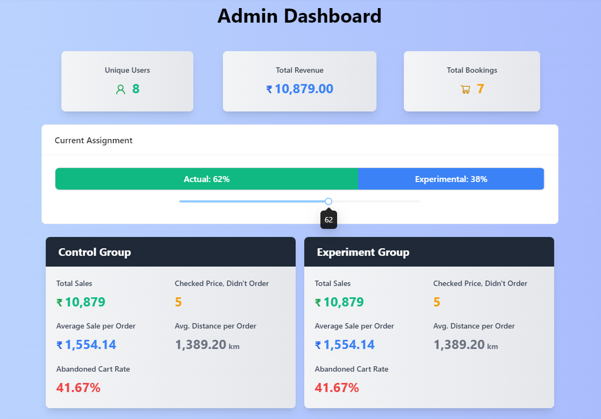

# SMILe Hackathon Project (Team: Deqoders)


## Overview

**LogiPredict** optimizes logistics services by leveraging data-driven insights and machine learning. It offers tools for predictive pricing and A/B testing, helping businesses improve their logistics operations efficiently.

## Features

### User Features

- **Home Screen**
  - Overview of past bookings.
  - Quick access to essential features for an improved booking experience.
- **Login/Registration Page**
  - Secure sign-up and login options.
  - Google Sign-In option for easy access.
- **Booking Page**

  - **Weight is Key**: Specify the weight of packages for accurate pricing.
  - **Distance Matters**: Input the delivery distance to optimize route and cost.
  - **Number of Packages**: Enter the number of packages to determine delivery slots.
  - **Extra Care for Secure Delivery**: Options for enhanced security during delivery.
  - **Shipping Types**: Choose from different shipping options based on urgency and cost.

- **Confirmation Page**
  - Summary of the booking order.
  - Display the total cost based on the ML model's prediction.
  - Show delivery route and tracking via Ola Maps API.

### Admin Features

- **Home Screen**
  - Overview of all revenues and sales metrics.
  - Key insights and metrics for data-driven decisions.
  - Option to adjust the experiment-to-production ratio for the ML model.
- **Login/Registration Page**
  - Secure login options for administrators.

## Tech Stack

### Frontend

- **React + Vite**: Blazing-fast development with modern frontend tools.
- **OLA Maps API**: For handling maps and location-based services.
- **Clerk**: User authentication and management.
- **Tailwind CSS**: Styling and responsive design.
- **Moment.js**: For handling dates and times.

### Backend

- **Express**: Node.js web framework for building the API.
- **NeonDB (PostgreSQL)**: PostgreSQL as a Service for managing and querying the database.
- **Axios**: For making HTTP requests from the frontend to the backend.

### Deployment

- **Vercel**: Hosting and deployment for the frontend and backend.
- **Google Cloud**: Hosting and deployment for the ML model.
- **NeonDB**: Hosting and deployment for PostgreSQL.

## Setup and Installation

### Prerequisites

- Node.js (>= 14.x)
- npm or yarn
- PostgreSQL (via NeonDB or local instance)

### Installation

Follow the steps below to set up the project on your local machine.

#### 1. Clone the Repository

```bash
git clone https://github.com/praveensaharan/SMILe-hackathon.git
cd SMILe-hackathon
```

#### 2. Navigate to the Project Directory

- **Frontend**:

  ```bash
  cd frontend
  ```

- **Backend**:
  ```bash
  cd backend
  ```

#### 3. Install Dependencies

```bash
npm install
# or
yarn install
```

#### 4. Run the Development Server

- **Frontend**:

  ```bash
  npm run dev
  # or
  yarn dev
  ```

- **Backend**:
  ```bash
  node index.js
  ```

#### 5. Access the App

- **Frontend**: Open your browser and navigate to `http://localhost:5173`
- **Backend**: The backend server will be running at `http://localhost:3000`

### Configuration

Configurations for the application, such as environment variables, can be managed through `.env` files or directly within the configuration files in the frontend and backend directories.

### Troubleshooting

If you encounter any issues during installation or while running the project, consider the following:

- Ensure all dependencies are installed by running `npm install` or `yarn install`.
- Make sure that ports `5173` (frontend) and `3000` (backend) are not in use by other applications.
- Check the terminal/console output for any error messages and resolve them as indicated.

## Contributors

- **Praveen Saharan** - [GitHub](https://github.com/praveensaharan)

## Contributing

1. Fork the project.
2. Create a feature branch (`git checkout -b feature-branch`).
3. Commit your changes (`git commit -m 'Add feature'`).
4. Push to the branch (`git push origin feature-branch`).
5. Open a Pull Request.

## Acknowledgements

- Thanks to Shree Maruti Integrated Logistics Limited for providing this opportunity to build a meaningful project through the hackathon.



